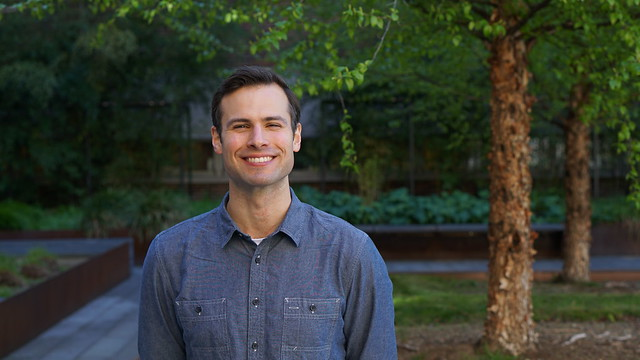

---

---

# Home

I'm currently a PhD candidate in the [Department of Biostatistics](https://www.biostat.washington.edu/) at the [University of Washington](https://www.washington.edu/). I expect to graduate by the end of 2019. 

My dissertation work is with [Marco Carone](http://faculty.washington.edu/mcarone/about.html) and [Noah Simon](http://faculty.washington.edu/nrsimon/). We develop nonparametric methods for possibly high-dimensional data. For more information about this and other projects that I am involved in, check out my [Research Page](research.html).

My full cv is available [here](cv.html). 