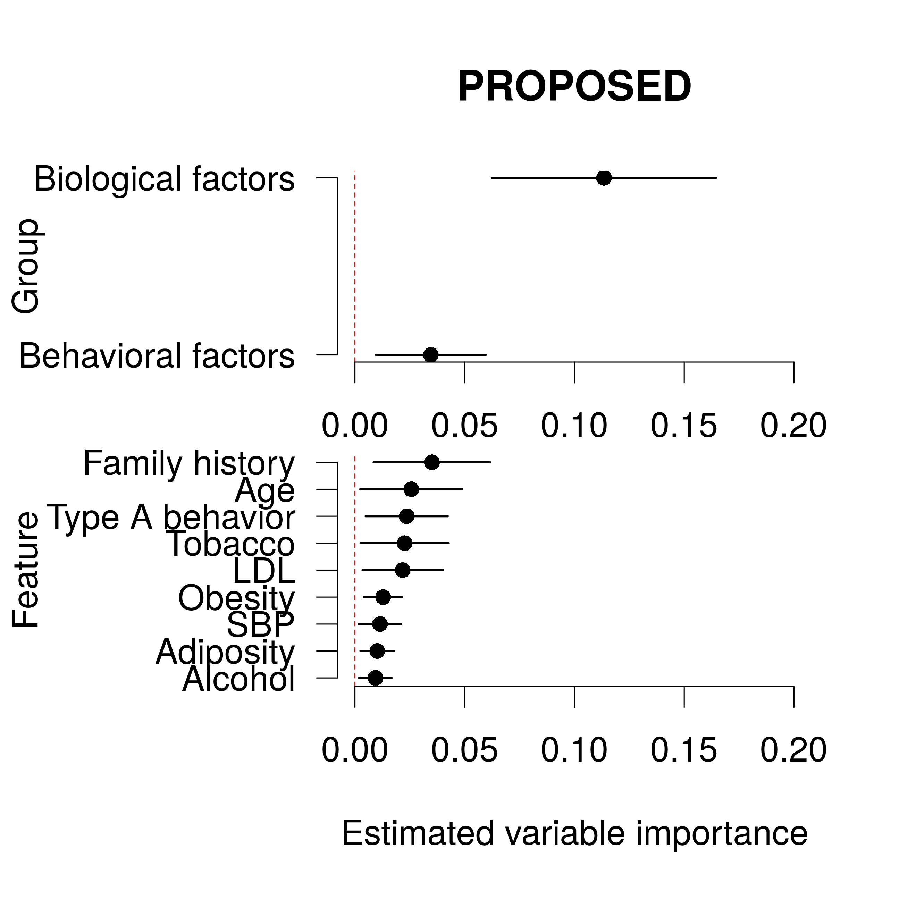
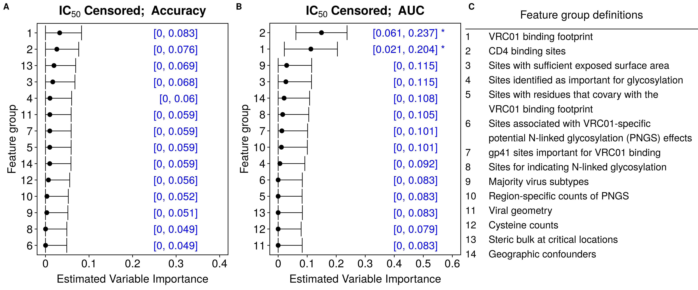
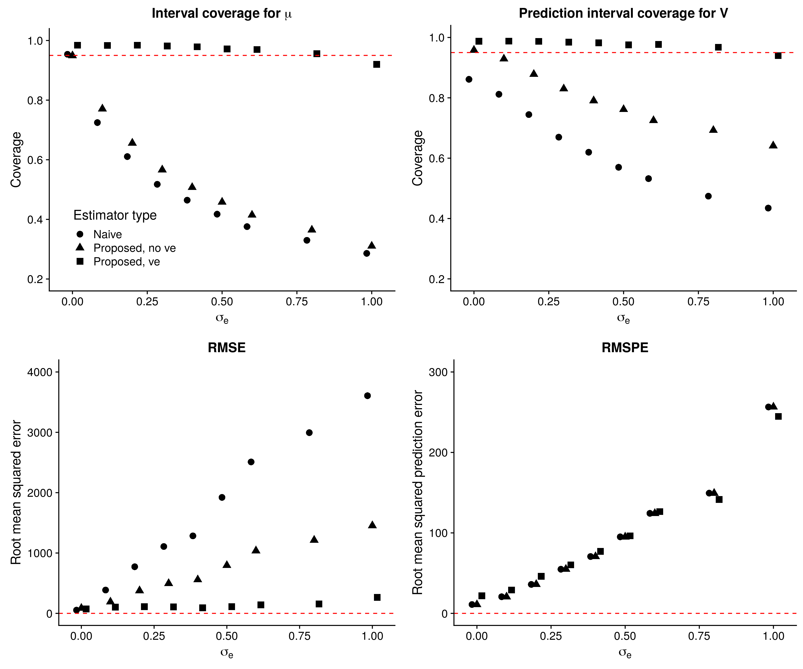
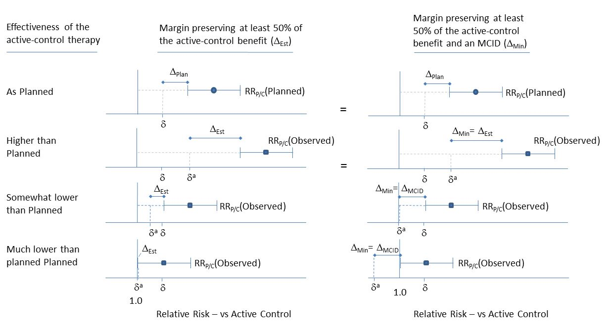
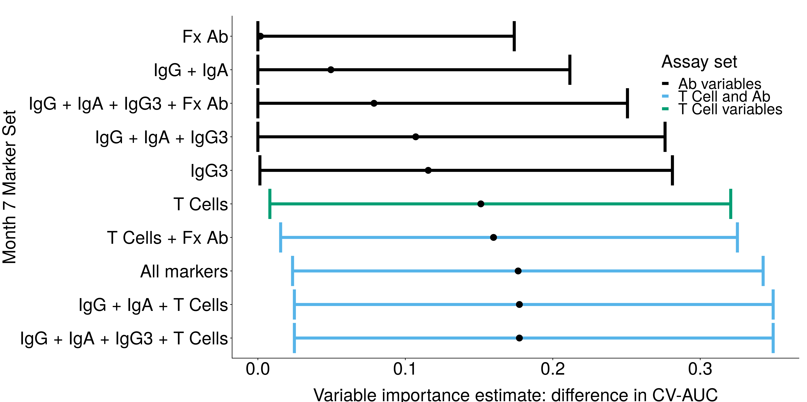

I am interested in problems of high-dimensional data, data science, and statistical inference. In particular, I enjoy working on developing new methodology for addressing scientific questions using large and complex datasets, and appropriately quantifying uncertainty in the resulting estimates. I also enjoy working on problems involving how best to tell a story using data. I have been primarily motivated by applications in public health and medicine, but I am always open to collaborations on interesting problems in any area of research.

To date, I have been primarily focused on developing an algorithm-agnostic measure of variable importance. This allows estimates of importance to be compared across different machine learning algorithms. The work develops a rigorous framework for estimating and performing valid statistical inference on the true importance. While the procedure is broadly applicable, one area in which we have employed the procedure is the study of vaccine efficacy. Our proposed approach allows investigators to use state-of-the-art machine learning tools to estimate important variables for predicting when a vaccine is effective. This, in turn, may help to more quickly develop new candidate vaccines for a range of diseases.

For a complete list of my scholarly works, please see my [Google Scholar page](https://scholar.google.com/citations?user=k4RWx44AAAAJ&hl=en).

# Statistical methods

## Variable importance

It is often of interest to understand the population interplay between the outcome and measured covariates. Variable importance is a useful tool towards this goal. Examples include: HIV vaccine studies, correlates of risk analyses, and identifying patients at high risk of returning to a hospital after discharge for heart failure. This is joint work with [Marco Carone](http://faculty.washington.edu/mcarone/about.html), [Peter Gilbert](https://www.fredhutch.org/en/labs/profiles/gilbert-peter.html), and [Noah Simon](http://faculty.washington.edu/nrsimon/).

[R (GitHub)](https://github.com/bdwilliamson/vimp) | [R (CRAN)](https://CRAN.R-project.org/package=vimp) | [Python (GitHub)](https://github.com/bdwilliamson/vimpy) | [Python (PyPI)](https://pypi.org/project/vimpy/)

In one project, we focus on a nonparametric extension of the classical measure based on the difference in R-squared (from linear models). We provide a simple approach for estimation that incorporates machine learning tools, and yields valid confidence intervals for the true importance.

[preprint](http://biostats.bepress.com/uwbiostat/paper422/) | [video and technical slides](https://briandwilliamson.tumblr.com)

<figure>
 
 <figcaption>
 Estimated variable importance using the proposed estimator and data from the South African heart disease study.
 </figcaption>
</figure>

In a second project, we extend our approach to handle nonparametric extensions of many interesting measures, including the difference in classification accuracy, the difference in area under the receiver operating characteristic curve, and the difference in deviance. We also propose a test for the null hypothesis of zero importance that has proper type I error control.

[preprint](https://arxiv.org/abs/2004.03683)

<figure>
 
 <figcaption>
 Estimated variable importance for predicting sensitivity of HIV-1 pseudoviruses to neutralization by a broadly neutralizing antibody.
 </figcaption>
</figure>

## Estimating microbial abundance

In this work, we propose a statistical method for combining inexpensive (but often lower-quality) estimates of relative abundance (e.g., collected using universal primers for the 16S rRNA gene) and higher quality (but often expensive) estimates of absolute abundance (e.g., from quantitative PCR) to estimate absolute abundance of all taxa. Crucially, our proposal accounts for differences in the efficiency of taxon detection in the relative and absolute abundance data. This is joint work with [Jim Hughes](http://faculty.washington.edu/jphughes/) and [Amy Willis](http://statisticaldiversitylab.com/team/amy-willis).

[preprint](https://biorxiv.org/cgi/content/short/761486v1) | [GitHub](https://github.com/statdivlab/paramedic)

<figure>
 
 <figcaption>
 Proposed estimator of relative abundance that allows for potentially varying efficiencies ("proposed, ve") versus a simple model that does not allow for varying efficiencies ("proposed, no ve") and a naive model ("naive").
 </figcaption>
</figure>

## Clinical trials

In settings where it is not ethical to perform a classical placebo-controlled trial, new interventions must be evaluated against the standard of care. Non-inferiority trials are often used to evaluate new interventions in this context. Here, the goal is for the experimental intervention to be "not unacceptably worse" than the standard of care, so that there are an increased number of viable intervention options. A common assumption in non-inferiority trials is that the active control population (typically receiving standard of care) is similar to the populations in prior placebo-controlled randomized trials. However, if characteristics in the current trial differ from previous trials -- for example, adherence to the active control regimen is lesser or greater than planned -- then the chance of a false positive result (type I error) or a false negative result (type II error) can be different than planned. In this work, we proposed a method for rigorously adapting a non-inferiority trial based on observed characteristics of the active control participants. This is joint work with [Deborah Donnell](https://www.fredhutch.org/en/labs/profiles/donnell-deborah.html), [Brett Hanscom](https://www.fredhutch.org/en/labs/profiles/hanscom-brett.html), and Jim Hughes.

[journal](https://journals.sagepub.com/doi/10.1177/0962280218801134#) | [PubMed](https://www.ncbi.nlm.nih.gov/pubmed/30293490)

<figure>
 
 <figcaption>
 Changes to estimated effectiveness of the experimental therapy under different assumptions about the effectiveness of the active control therapy.
 </figcaption>
</figure>

# Collaborative science

## HIV vaccines

### Broadly neutralizing antibodies

The broadly neutralizing antibody VRC01, developed by the Vaccine Research Center of the National Institute of Allergy and Infectious Diseases, is currently being evaluated in the [Antibody Mediated Prevention](https://ampstudy.org/) study (AMP). While the primary goal of AMP is to assess the preventative efficacy of VRC01, a key secondary goal is to determine if this efficacy differs based on characteristics of the HIV virus. There are many possible locations on the HIV genome that we might be interested in; if we simply did a statistical test for association at each possible location, and then appropriately accounted for this multiple testing, then we would have low power to detect effects. To prepare for AMP, we used data on HIV viruses from the [Compile, Neutralize, and Tally NAb Panels](https://www.hiv.lanl.gov/components/sequence/HIV/neutralization/main.comp) database. Our goals were to: (i) develop a score that performed well for predicting whether or not an HIV virus was sensitive to neutralization by VRC01, and (ii) to identify groups of HIV genome features that were important in predicting neutralization sensitivity.

[journal](https://journals.plos.org/ploscompbiol/article?id=10.1371/journal.pcbi.1006952) | [PubMed](https://www.ncbi.nlm.nih.gov/pubmed/?term=Prediction+of+VRC01+neutralization+sensitivity+by+HIV-1+gp160+sequence+features) | [GitHub](https://github.com/benkeser/vrc01) | [Fred Hutch Science Spotlight](https://www.fredhutch.org/en/news/spotlight/2019/05/vidd_magaret_ploscompbio.html)

We are currently working on extending the methods used for the VRC01 analysis to combinations of antibodies -- a prevention strategy involving multiple bnAbs is likely to be much more effective than a strategy with a single bnAb. Both projects are joint work with [Craig Magaret](https://www.linkedin.com/in/camagaret/), [David Benkeser](https://www.benkeserstatistics.com/#!), Peter Gilbert, and others.

<figure>
 
 <figcaption>
 ROC curves for a proposed VRC01 neutralization sensitivity predictor. Inset: 3D structure of the HIV Envelope protein with colored areas based on identified important features and groups using our proposed variable importance measure.
 </figcaption>
</figure>

### Correlates of risk and protection

While we do not yet have a broadly efficacious vaccine against HIV-1, clinical trials of HIV-1 vaccine candidates can identify potential correlates of risk or of protection. These correlates are measurable signs that a person is at risk of or is protected from infection by HIV-1, respectively. In this work, I collaborated with Peter Gilbert and others affiliated with the [HIV Vaccine Trials Network](https://www.hvtn.org/en.html) to analyze data from the [HVTN 505](https://www.hvtn.org/en/community/community-compass/vol19-issue1/hvtn-505-recap.html) clinical trial. We identified three antibody features that inversely correlated with HIV-1 infection risk. This may help in designing future HIV-1 vaccines.

[journal](https://doi.org/10.1172/JCI126391) | [commentary](https://doi.org/10.1172/JCI132535) | [Fred Hutch Science Spotlight](https://www.fredhutch.org/en/news/spotlight/2019/11/neidich_vidd_jci.html)

<figure>
 
 <figcaption>
 Estimated variable importance (relative to baseline risk variables) of immune response marker sets measured at 7 months after vaccination. Abbreviations: Ab = antibody, Fx = functional.
 </figcaption>
</figure>

## HIV prevention

### Characteristics associated with HIV risk

This study is based on data from the HIV Prevention Trials Network (HPTN) trial 068. In this work, we aimed to identify factors associated with age-discordant partnerships (one partner greater than 5 years older than the other) and examine the association between partner age discordance and HIV risk in young South African women. We found that a history of age-discordant partnerships is associated witih greater odds of reporting HIV risk factors. This is joint work with [Tiarney Ritchwood](https://fmch.duke.edu/profile/tiarney-ritchwood), Jim Hughes, and others.

[journal](https://insights.ovid.com/article/00126334-201608010-00010) | [PubMed](https://www.ncbi.nlm.nih.gov/pubmed/26977748)

### HIV Treatment as Prevention

HPTN 063 was a clinical trial that aimed to examine potential HIV transmissions and the frequency of bacterial sexually transmitted infection (STI) acquisition among an international group of HIV-positive individuals in HIV care. The long-term goal was to inform treatment-as-prevention programs and provide ways of evaluating the potential impact of such programs. We found that there were substantial numbers of both estimated HIV transmissions and STIs, despite sampling individuals in HIV care. This suggested that augmenting secondary prevention interventions may be a means to decrease HIV incidence. This is joint work with [Steven Safren](https://people.miami.edu/profile/sas436@miami.edu), Jim Hughes, and others.

[journal](https://onlinelibrary.wiley.com/doi/full/10.7448/IAS.19.1.21096) | [PubMed](https://www.ncbi.nlm.nih.gov/pubmed/27687145)

## Cancer treatment

### Optimizing cancer treatment strategies using single-cell data

In this work, our goal was to develop an algorithm for optimally assigning patients to cancer treatment strategies. We leveraged data from single-cell mass cytometry to: automatically determine subpopulations of cells; create a nested effects model to infer gene hierarchy based on perturbation effects due to administered drugs; and create a scoring and ranking algorithm that identifies the minimal number of drugs among a combination of drugs with teh maximal desired intracellular effects. This is joint work with [Sylvia Plevritis](http://med.stanford.edu/plevritis.html), [Benedict Anchang](http://med.stanford.edu/plevritis.html/People), and others.

[journal](https://www.pnas.org/content/115/18/E4294) | [pdf](https://www.pnas.org/content/pnas/115/18/E4294.full.pdf)

<figure>
 
 <figcaption>
 Distribution plot showing the patient-specific optimal drug combination predictions by DRUG-NEM. The single dominant two-drug strategy (BEZ + Das) for 60% of patients may not be optimal for all patients.
 </figcaption>
</figure>

