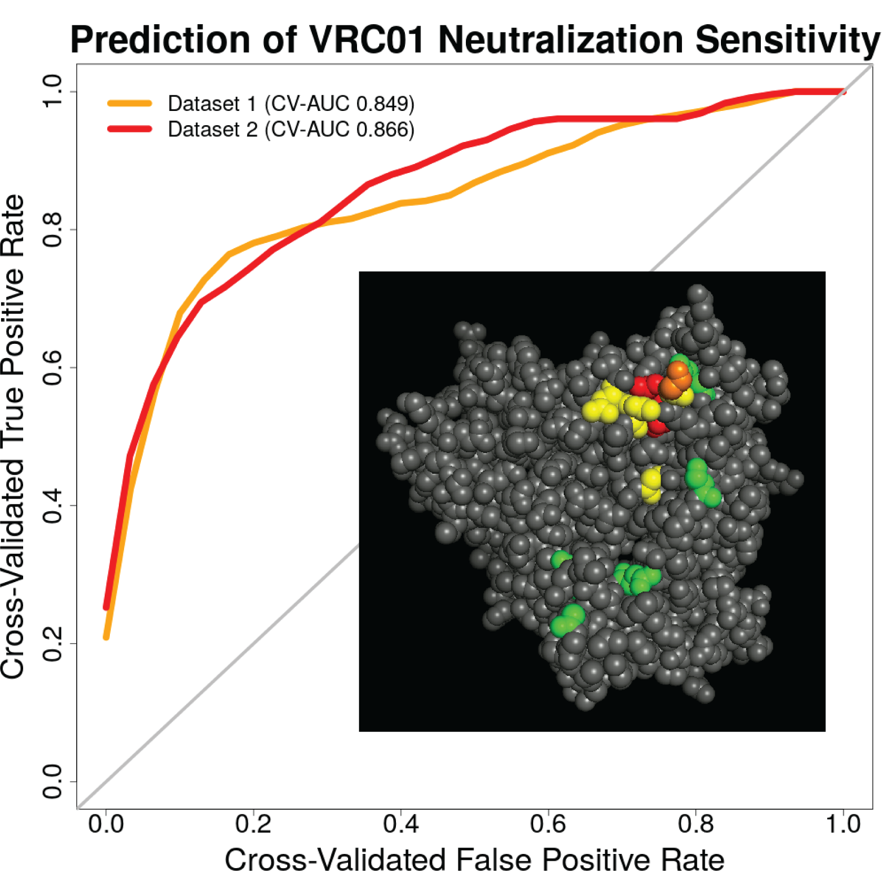

# Research

I am interested in problems of high-dimensional data, data science, and statistical inference. In particular, I enjoy working on developing new methodology for addressing scientific questions using large and complex datasets, and appropriately quantifying uncertainty in the resulting estimates. I also enjoy working on problems involving how best to tell a story using data. I have been primarily motivated by applications in public health and medicine, but I am always open to collaborations on interesting problems in any area of research.

To date, I have been primarily focused on developing a unified, model-free framework for assessing variable importance. We leverage tools from both machine learning and targeted learning to efficiently estimate a statistical parameter of interest, and provide appropriate estimates of uncertainty.

## Statistical methods

### Variable importance

Vaccine efficacy trials often provide preliminary evidence of risk factors that predict vaccine efficacy. Recent advances in machine learning technology have simplified the process of developing high-performance predictive models. Rigorously evaluating immune correlates of risk and of protection involves both efficiently estimating the importance of features in predicting vaccine efficacy and hypothesis testing to investigate the proposed correlates. To date, rigorous statistical methods for efficient estimation of and valid inference for feature importance are lacking when flexible methods are used in prediction. In this work, I develop statistical methods to enable more efficient use of vaccine trial data to discover novel relationships between vaccines and disease, yielding a deeper understanding of how to develop better vaccine candidates and where to deploy existing vaccines. The work is more broadly applicable as well: in many cases, we are interested in understanding the population interplay between the outcome and measured covariates, and variable importance is a useful tool towards this goal. Examples include: HIV vaccine studies, correlates of risk analyses, and identifying patients at high risk of returning to a hospital after discharge for heart failure. This is joint work with [Marco Carone](http://faculty.washington.edu/mcarone/about.html), [Peter Gilbert](https://www.fredhutch.org/en/labs/profiles/gilbert-peter.html), and [Noah Simon](http://faculty.washington.edu/nrsimon/).

[preprint](http://biostats.bepress.com/uwbiostat/paper422/) | [R (GitHub)](https://github.com/bdwilliamson/vimp) | [R (CRAN)](https://CRAN.R-project.org/package=vimp) | [Python (GitHub)](https://github.com/bdwilliamson/vimpy) | [Python (PyPI)](https://pypi.org/project/vimpy/) | [video and technical slides](https://briandwilliamson.tumblr.com)

### Clinical trials

In many cases, it is not ethical to perform a classical placebo-controlled trial. In these settings, new interventions must be evaluated against the standard of care, and non-inferiority trials are often used to make this evaluation. Here, the goal is for the experimental intervention to be "not unacceptably worse" than the standard of care, so that there are an increased number of viable intervention options. A common assumption in non-inferiority trials is that the active control population (typically receiving standard of care) is similar to the populations in prior placebo-controlled randomized trials. However, if characteristics in the current trial differ from previous trials -- for example, adherence to the active control regimen is lesser or greater than planned -- then the chance of a false positive result (type I error) or a false negative result (type II error) can be different than planned. In this work, we proposed a method for rigorously adapting a non-inferiority trial based on observed characteristics of the active control participants. This is joint work with [Deborah Donnell](https://www.fredhutch.org/en/labs/profiles/donnell-deborah.html), [Brett Hanscom](https://www.fredhutch.org/en/labs/profiles/hanscom-brett.html), and [Jim Hughes](http://faculty.washington.edu/jphughes/).

[journal](https://journals.sagepub.com/doi/10.1177/0962280218801134#) | [PubMed](https://www.ncbi.nlm.nih.gov/pubmed/30293490)

## Collaborative science

### HIV vaccines

#### Broadly neutralizing antibodies

Patients living with HIV or AIDS usually require a combination of antiretroviral therapy (ART) and supportive care for life. Understanding how features of the HIV genotype explain the susceptibility of the HIV virus to neutralization by broadly neutralizing antibodies (bnAbs) against HIV could lead to a broadly efficacious vaccine against HIV infection, either by using a combination of bnAbs or by developing more potent or longer lasting bnAbs that target certain important regions of the HIV genotype. These advances have the potential to make a large public health impact by reducing the number of incident HIV infections, thus reducing the use of ART and the need for supportive care.

The bnAb VRC01, developed by the Vaccine Research Center of the National Institute of Allergy and Infectious Diseases, is currently being evaluated in the [Antibody Mediated Prevention](https://ampstudy.org/) study (AMP). While the primary goal of AMP is to assess the preventative efficacy of VRC01, a key secondary goal is to determine if this efficacy differs based on characteristics of the HIV virus. There are many possible locations on the HIV genome that we might be interested in; if we simply did a statistical test for association at each possible location, and then appropriately accounted for this multiple testing, then we would have low power to detect effects. To prepare for AMP, we used data on HIV viruses from the [Compile, Neutralize, and Tally NAb Panels](https://www.hiv.lanl.gov/components/sequence/HIV/neutralization/main.comp) database. Our goals were to: (i) develop a score that performed well for predicting whether or not an HIV virus was sensitive to neutralization by VRC01, and (ii) to identify groups of HIV genome features that were important in predicting neutralization sensitivity. 

[journal](https://journals.plos.org/ploscompbiol/article?id=10.1371/journal.pcbi.1006952) | [PubMed](https://www.ncbi.nlm.nih.gov/pubmed/?term=Prediction+of+VRC01+neutralization+sensitivity+by+HIV-1+gp160+sequence+features) | [GitHub](https://github.com/benkeser/vrc01) | [Fred Hutchinson Cancer Research Center Science Spotlight](https://www.fredhutch.org/en/news/spotlight/2019/05/vidd_magaret_ploscompbio.html)

We are currently working on extending the methods used for the VRC01 analysis to combinations of antibodies -- a prevention strategy involving multiple bnAbs is likely to be much more effective than a strategy with a single bnAb. Both projects are joint work with [Craig Magaret](https://www.linkedin.com/in/camagaret/), [David Benkeser](https://www.benkeserstatistics.com/#!), Peter Gilbert, and others.

### HIV prevention

#### Characteristics associated with HIV risk

This study is based on data from the HIV Prevention Trials Network (HPTN) trial 068. In this work, we aimed to identify factors associated with age-discordant partnerships (one partner greater than 5 years older than the other) and examine the association between partner age discordance and HIV risk in young South African women. We found that a history of age-discordant partnerships is associated witih greater odds of reporting HIV risk factors. This is joint work with [Tiarney Ritchwood](https://fmch.duke.edu/profile/tiarney-ritchwood), Jim Hughes, and others.

[journal](https://insights.ovid.com/article/00126334-201608010-00010) | [PubMed](https://www.ncbi.nlm.nih.gov/pubmed/26977748)

#### HIV Treatment as Prevention

HPTN 063 was a clinical trial that aimed to examine potential HIV transmissions and the frequency of bacterial sexually transmitted infection (STI) acquisition among an international group of HIV-positive individuals in HIV care. The long-term goal was to inform treatment-as-prevention programs and provide ways of evaluating the potential impact of such programs. We found that there were substantial numbers of both estimated HIV transmissions and STIs, despite sampling individuals in HIV care. This suggested that augmenting secondary prevention interventions may be a means to decrease HIV incidence. This is joint work with [Steven Safren](https://people.miami.edu/profile/sas436@miami.edu), Jim Hughes, and others.

[journal](https://onlinelibrary.wiley.com/doi/full/10.7448/IAS.19.1.21096) | [PubMed](https://www.ncbi.nlm.nih.gov/pubmed/27687145)

### Cancer treatment

#### Optimizing cancer treatment strategies using single-cell data

In this work, our goal was to develop an algorithm for optimally assigning patients to cancer treatment strategies. We leveraged data from single-cell mass cytometry to: automatically determine subpopulations of cells; create a nested effects model to infer gene hierarchy based on perturbation effects due to administered drugs; and create a scoring and ranking algorithm that identifies the minimal number of drugs among a combination of drugs with teh maximal desired intracellular effects. This is joint work with [Sylvia Plevritis](http://med.stanford.edu/plevritis.html), [Benedict Anchang](http://med.stanford.edu/plevritis.html/People), and others.

[journal](https://www.pnas.org/content/115/18/E4294) | [pdf](https://www.pnas.org/content/pnas/115/18/E4294.full.pdf)